# PLSQL Assignment One - Sunrise Supermarket
**Student name: **Neza Faith Nina
**Student ID: *20252SEN256
**DBMS used:PostgreSQL


## 1. Business scenario summary

Sunrise Supermarket sells products to customers, who place orders containing one or more items. Management wants to understand who their customers are, what they buy, and how sales are trending over time.

The database has four tables:
- `customers` (customer_id, customer_name, email, city)
- `products` (product_id, product_name, category, price)
- `orders` (order_id, customer_id, order_date)
- `order_items` (order_item_id, order_id, product_id, quantity)

## 2. What I did and how to run it

1. Created the four tables and loaded sample data: 6 customers, 8 products in 4 categories (Grocery, Dairy, Beverages, Household), 15 orders between March and August 2026, and 25 order items.
2. Wrote 3 JOIN queries, 1 CTE query and 4 window-function queries (below).
3. Interpreted the results for management.

**To run:** open Oracle SQL Developer (or Live SQL / SQL*Plus), run `assignment_1.sql` from top to bottom, and run each query on its own to see its result.

---

## 3. Sample data

Screenshots of the loaded tables prove the data meets the requirements (at least 5 customers, 8 products in 3+ categories, 15 orders, 25 order items).

### Table: customers


### Table: products


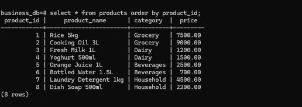


### Table: orders


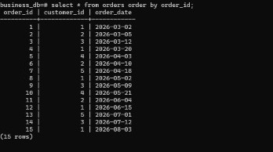


### Table: order_items

📸 **TAKE SCREENSHOT** -> save as `screenshots/data_order_items.png`

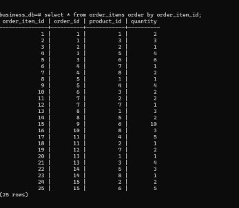


### Table: row counts


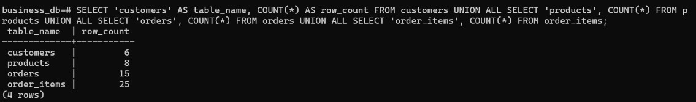


## 4. Queries, explanations and results

### Q1 (JOIN) - Orders with customer name, city and date (INNER JOIN)

**What it answers:** Shows who placed every order, where they live and when. Only orders that have a matching customer appear (all 15).

```sql
SELECT o.order_id,
       c.customer_name,
       c.city,
       o.order_date
FROM   orders o
INNER JOIN customers c ON c.customer_id = o.customer_id
ORDER BY o.order_date, o.order_id;
```

📸 **TAKE SCREENSHOT** of the Q1 result -> save as `screenshots/q1.png`

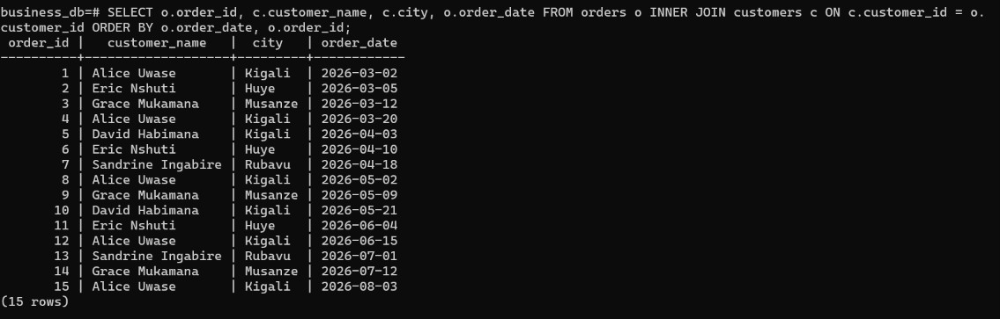


### Q2 (JOIN) - Order items with product details (JOIN)

**What it answers:** Shows what was bought on each order line, with product name, category, unit price and quantity (all 25 lines).

```sql
SELECT oi.order_item_id,
       oi.order_id,
       p.product_name,
       p.category,
       p.price,
       oi.quantity
FROM   order_items oi
INNER JOIN products p ON p.product_id = oi.product_id
ORDER BY oi.order_item_id;
```

📸 **TAKE SCREENSHOT** of the Q2 result -> save as `screenshots/q2.png`

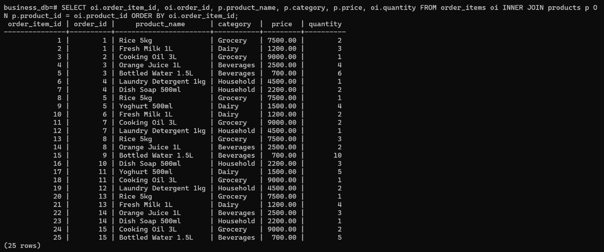


### Q3 (JOIN) - All customers and their orders (LEFT JOIN)

**What it answers:** Keeps every customer even without orders. Patrick Mugisha has no orders, so his order columns are NULL. That is why there are 16 rows (15 orders + 1 customer with none).

```sql
SELECT c.customer_id,
       c.customer_name,
       o.order_id,
       o.order_date
FROM   customers c
LEFT JOIN orders o ON o.customer_id = c.customer_id
ORDER BY c.customer_id, o.order_date;
```

📸 **TAKE SCREENSHOT** of the Q3 result -> save as `screenshots/q3.png`

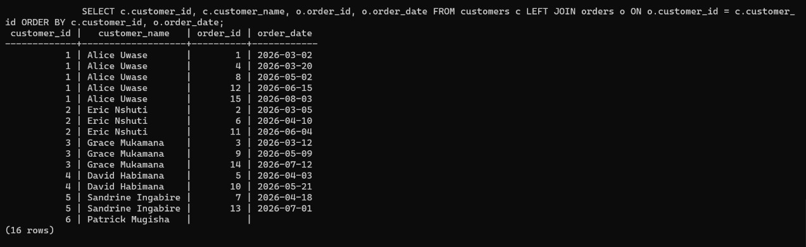

**Expected result (16 rows):**

| customer_id | customer_name | order_id | order_date |
|---|---|---|---|
| 1 | Alice Uwase | 1 | 2026-03-02 |
| 1 | Alice Uwase | 4 | 2026-03-20 |
| 1 | Alice Uwase | 8 | 2026-05-02 |
| 1 | Alice Uwase | 12 | 2026-06-15 |
| 1 | Alice Uwase | 15 | 2026-08-03 |
| 2 | Eric Nshuti | 2 | 2026-03-05 |
| 2 | Eric Nshuti | 6 | 2026-04-10 |
| 2 | Eric Nshuti | 11 | 2026-06-04 |
| 3 | Grace Mukamana | 3 | 2026-03-12 |
| 3 | Grace Mukamana | 9 | 2026-05-09 |
| 3 | Grace Mukamana | 14 | 2026-07-12 |
| 4 | David Habimana | 5 | 2026-04-03 |
| 4 | David Habimana | 10 | 2026-05-21 |
| 5 | Sandrine Ingabire | 7 | 2026-04-18 |
| 5 | Sandrine Ingabire | 13 | 2026-07-01 |
| 6 | Patrick Mugisha | NULL | NULL |


### Q4 (CTE) - Customers who spent above the average (CTE)

**What it answers:** The CTE `customer_totals` calculates each customer's total spend (quantity x price). The main query keeps only customers whose total is higher than the average of those totals (39,840). Only Alice qualifies.

```sql
WITH customer_totals AS (
  SELECT c.customer_id,
         c.customer_name,
         SUM(oi.quantity * p.price) AS total_spent
  FROM   customers c
  JOIN   orders o       ON o.customer_id = c.customer_id
  JOIN   order_items oi ON oi.order_id   = o.order_id
  JOIN   products p     ON p.product_id  = oi.product_id
  GROUP BY c.customer_id, c.customer_name
)
SELECT customer_id,
       customer_name,
       total_spent
FROM   customer_totals
WHERE  total_spent > (SELECT AVG(total_spent) FROM customer_totals)
ORDER BY total_spent DESC;
```

📸 **TAKE SCREENSHOT** of the Q4 result -> save as `screenshots/q4.png`

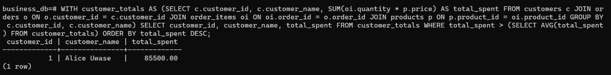

**Expected result (1 rows):**

| customer_id | customer_name | total_spent |
|---|---|---|
| 1 | Alice Uwase | 85500 |


### Q5 (Window function) - Rank customers by total spent (RANK window function)

**What it answers:** Ranks customers from highest to lowest spender using `RANK() OVER (ORDER BY total_spent DESC)` on top of the same CTE.

```sql
WITH customer_totals AS (
  SELECT c.customer_id,
         c.customer_name,
         SUM(oi.quantity * p.price) AS total_spent
  FROM   customers c
  JOIN   orders o       ON o.customer_id = c.customer_id
  JOIN   order_items oi ON oi.order_id   = o.order_id
  JOIN   products p     ON p.product_id  = oi.product_id
  GROUP BY c.customer_id, c.customer_name
)
SELECT customer_id,
       customer_name,
       total_spent,
       RANK() OVER (ORDER BY total_spent DESC) AS spend_rank
FROM   customer_totals
ORDER BY spend_rank;
```

📸 **TAKE SCREENSHOT** of the Q5 result -> save as `screenshots/q5.png`

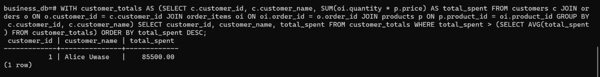

**Expected result (5 rows):**

| customer_id | customer_name | total_spent | spend_rank |
|---|---|---|---|
| 1 | Alice Uwase | 85500 | 1 |
| 5 | Sandrine Ingabire | 34800 | 2 |
| 3 | Grace Mukamana | 30900 | 3 |
| 2 | Eric Nshuti | 27900 | 4 |
| 4 | David Habimana | 20100 | 5 |


### Q6 (Window function) - Number each customer's orders (ROW_NUMBER)

**What it answers:** `ROW_NUMBER() OVER (PARTITION BY customer ORDER BY order_date)` restarts at 1 for each customer, so we see their 1st, 2nd, 3rd order and so on.

```sql
SELECT c.customer_id,
       c.customer_name,
       o.order_id,
       o.order_date,
       ROW_NUMBER() OVER (
         PARTITION BY o.customer_id
         ORDER BY o.order_date, o.order_id
       ) AS order_number
FROM   orders o
JOIN   customers c ON c.customer_id = o.customer_id
ORDER BY c.customer_id, order_number;
```

📸 **TAKE SCREENSHOT** of the Q6 result -> save as `screenshots/q6.png`

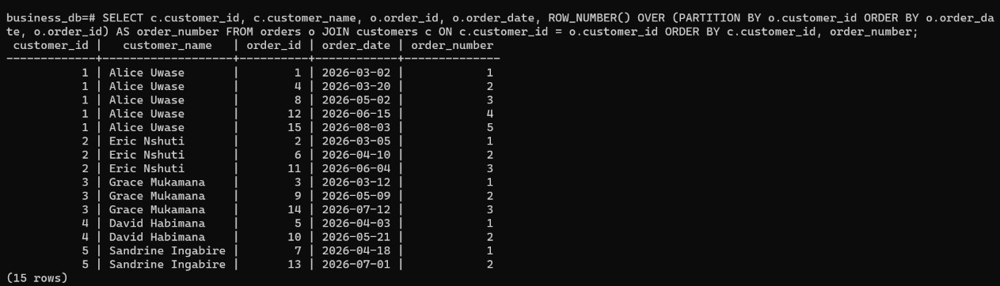

**Expected result (15 rows):**

| customer_id | customer_name | order_id | order_date | order_number |
|---|---|---|---|---|
| 1 | Alice Uwase | 1 | 2026-03-02 | 1 |
| 1 | Alice Uwase | 4 | 2026-03-20 | 2 |
| 1 | Alice Uwase | 8 | 2026-05-02 | 3 |
| 1 | Alice Uwase | 12 | 2026-06-15 | 4 |
| 1 | Alice Uwase | 15 | 2026-08-03 | 5 |
| 2 | Eric Nshuti | 2 | 2026-03-05 | 1 |
| 2 | Eric Nshuti | 6 | 2026-04-10 | 2 |
| 2 | Eric Nshuti | 11 | 2026-06-04 | 3 |
| 3 | Grace Mukamana | 3 | 2026-03-12 | 1 |
| 3 | Grace Mukamana | 9 | 2026-05-09 | 2 |
| 3 | Grace Mukamana | 14 | 2026-07-12 | 3 |
| 4 | David Habimana | 5 | 2026-04-03 | 1 |
| 4 | David Habimana | 10 | 2026-05-21 | 2 |
| 5 | Sandrine Ingabire | 7 | 2026-04-18 | 1 |
| 5 | Sandrine Ingabire | 13 | 2026-07-01 | 2 |


### Q7 (Window function) - Running total of revenue over time (SUM OVER)

**What it answers:** A CTE first finds revenue per order. `SUM(order_total) OVER (ORDER BY order_date ...)` then adds each order to everything before it, showing cumulative revenue (ends at 199,200).

```sql
WITH order_revenue AS (
  SELECT o.order_id,
         o.order_date,
         SUM(oi.quantity * p.price) AS order_total
  FROM   orders o
  JOIN   order_items oi ON oi.order_id  = o.order_id
  JOIN   products p     ON p.product_id = oi.product_id
  GROUP BY o.order_id, o.order_date
)
SELECT order_id,
       order_date,
       order_total,
       SUM(order_total) OVER (
         ORDER BY order_date, order_id
         ROWS BETWEEN UNBOUNDED PRECEDING AND CURRENT ROW
       ) AS running_total
FROM   order_revenue
ORDER BY order_date, order_id;
```

📸 **TAKE SCREENSHOT** of the Q7 result -> save as `screenshots/q7.png`

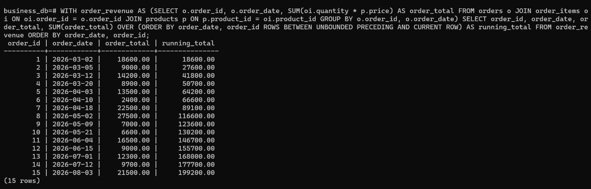

**Expected result (15 rows):**

| order_id | order_date | order_total | running_total |
|---|---|---|---|
| 1 | 2026-03-02 | 18600 | 18600 |
| 2 | 2026-03-05 | 9000 | 27600 |
| 3 | 2026-03-12 | 14200 | 41800 |
| 4 | 2026-03-20 | 8900 | 50700 |
| 5 | 2026-04-03 | 13500 | 64200 |
| 6 | 2026-04-10 | 2400 | 66600 |
| 7 | 2026-04-18 | 22500 | 89100 |
| 8 | 2026-05-02 | 27500 | 116600 |
| 9 | 2026-05-09 | 7000 | 123600 |
| 10 | 2026-05-21 | 6600 | 130200 |
| 11 | 2026-06-04 | 16500 | 146700 |
| 12 | 2026-06-15 | 9000 | 155700 |
| 13 | 2026-07-01 | 12300 | 168000 |
| 14 | 2026-07-12 | 9700 | 177700 |
| 15 | 2026-08-03 | 21500 | 199200 |


### Q8 (Window function) - Days between a customer's orders (LAG)

**What it answers:** `LAG(order_date)` fetches the customer's previous order date; subtracting gives days between orders. Rows without a previous order are removed, so only customers with more than one order remain.

```sql
WITH order_gaps AS (
  SELECT c.customer_id,
         c.customer_name,
         o.order_id,
         o.order_date,
         LAG(o.order_date) OVER (
           PARTITION BY o.customer_id
           ORDER BY o.order_date, o.order_id
         ) AS previous_order_date
  FROM   orders o
  JOIN   customers c ON c.customer_id = o.customer_id
)
SELECT customer_id,
       customer_name,
       order_id,
       order_date,
       previous_order_date,
       order_date - previous_order_date AS days_since_previous
FROM   order_gaps
WHERE  previous_order_date IS NOT NULL
ORDER BY customer_id, order_date;
```

📸 **TAKE SCREENSHOT** of the Q8 result -> save as `screenshots/q8.png`

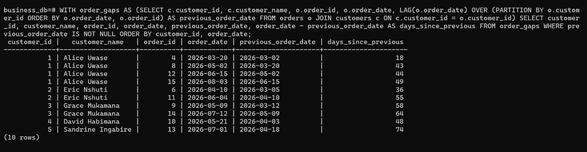

**Expected result (10 rows):**

| customer_id | customer_name | order_id | order_date | previous_order_date | days_since_previous |
|---|---|---|---|---|---|
| 1 | Alice Uwase | 4 | 2026-03-20 | 2026-03-02 | 18 |
| 1 | Alice Uwase | 8 | 2026-05-02 | 2026-03-20 | 43 |
| 1 | Alice Uwase | 12 | 2026-06-15 | 2026-05-02 | 44 |
| 1 | Alice Uwase | 15 | 2026-08-03 | 2026-06-15 | 49 |
| 2 | Eric Nshuti | 6 | 2026-04-10 | 2026-03-05 | 36 |
| 2 | Eric Nshuti | 11 | 2026-06-04 | 2026-04-10 | 55 |
| 3 | Grace Mukamana | 9 | 2026-05-09 | 2026-03-12 | 58 |
| 3 | Grace Mukamana | 14 | 2026-07-12 | 2026-05-09 | 64 |
| 4 | David Habimana | 10 | 2026-05-21 | 2026-04-03 | 48 |
| 5 | Sandrine Ingabire | 13 | 2026-07-01 | 2026-04-18 | 74 |


---

## 5. Business interpretation

*(This is a draft based on the results above. Reword it in your own words before you submit.)*

- **Overall sales:** Sunrise made 199,200 in revenue from 15 orders, about 13,280 per order (Q7).
- **Key customer:** Alice Uwase is the top spender with 85,500, about 43% of all revenue, and the only customer above the average spend of 39,840 (Q4, Q5). The other four buying customers are between 20,100 and 34,800. This shows the business depends heavily on one customer, which is a risk if she stops buying.
- **Inactive customer:** Patrick Mugisha is registered but has never placed an order (Q3). Management could send him a welcome discount to turn him into a buyer.
- **Sales trend:** Monthly revenue was 50,700 in March, 38,400 in April, 41,100 in May, 25,500 in June and 22,000 in July, so sales slowed over the period. August has only one order so far (21,500), dated 3 August (Q7). Management should look at promotions to lift the slower months.
- **Loyalty and repeat buying:** Repeat customers come back on average about every 49 days, with gaps between 18 and 74 days (Q8). Alice's gaps are getting longer (18, 43, 44, 49 days) and Sandrine waited 74 days, so a reminder or loyalty offer around day 30-40 could bring customers back sooner.
- **Order habits:** Alice has placed 5 orders, Eric and Grace 3 each, David and Sandrine 2 each (Q6), so most customers are repeat buyers, which is a good sign for customer retention.

## 6. Challenges and how I solved them

*(Draft. Replace with what actually happened to you.)*

- **Defining "average customer spend":** I calculated the average over customers who actually bought something (5 customers). Including Patrick at zero would lower the average to 33,200 and add Sandrine (34,800) to the above-average list. I chose the first meaning and stated it in the README.
- **Calculating spend:** quantity and price are in different tables, so I joined customers -> orders -> order_items -> products and used `SUM(quantity * price)` in a CTE, then reused that CTE for the average and the ranking.
- **Showing customers with no orders:** an INNER JOIN drops Patrick, so I used a LEFT JOIN for Q3.
- **Date difference in Q8:** used `LAG()` to get the previous date, then subtracted the two dates (Oracle and PostgreSQL return days directly; MySQL needs `DATEDIFF`). Removed the NULL first-order rows so only repeat customers show.
- **Consistent ordering:** for ROW_NUMBER, LAG and the running total I ordered by `order_date, order_id` so results stay the same if two orders share a date.
